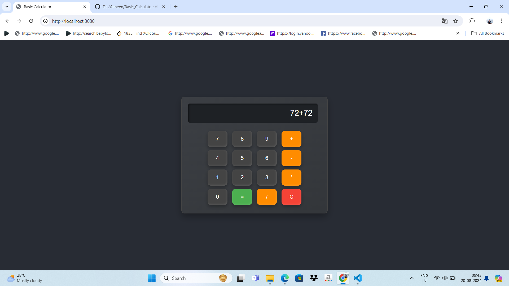
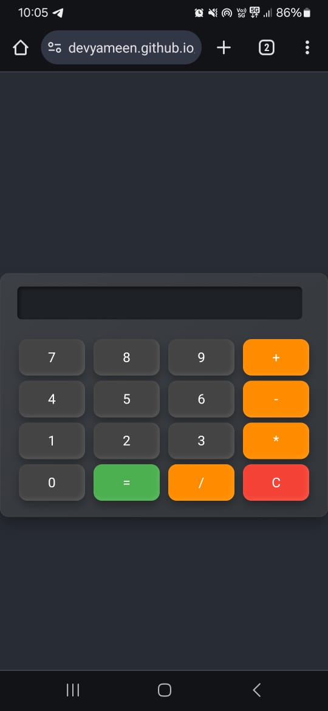

# Basic Calculator

Welcome to the Basic Calculator project! This is a simple yet elegant calculator application built with HTML, CSS, and JavaScript, and served using Node.js. The calculator performs basic arithmetic operations and features a modern, responsive design.


## Features

- **Basic Arithmetic Operations:** Addition, subtraction, multiplication, and division.
- **Responsive Design:** Looks great on both desktop and mobile devices.
- **Attractive UI:** Modern design with smooth animations and hover effects.
- **Error Handling:** Displays "Error" if an invalid calculation is entered.

## Getting Started

To get started with this project, follow these steps:

### Prerequisites

Make sure you have [Node.js](https://nodejs.org/) installed on your machine.

### Installation

1. **Clone the repository:**

   ```bash
   git clone https://github.com/yourusername/calculator-app.git
   cd calculator-app
Install dependencies:

This project does not require any additional Node.js dependencies for running the server. However, ensure that Node.js is installed to run the server.

Start the server:
   node server.js
Open your browser:

Go to http://localhost:8080 to view and use the calculator.

Usage
Click Numbers: Press the number buttons to input values.
Perform Calculations: Press the operator buttons (+, -, *, /) to select the operation.
Get Result: Press the = button to calculate the result.
Clear Input: Press the C button to clear the current input.
Screenshots
Here are some screenshots of the calculator in action:
Desktop View:
 

Mobile View:


Contributing
Feel free to contribute to this project by opening issues or submitting pull requests. For detailed instructions on contributing, please refer to the CONTRIBUTING.md file.

License
This project is licensed under the MIT License - see the LICENSE file for details.

Acknowledgements
Icons: Font Awesome
Inspiration: Modern UI/UX designs from various sources
Contact
If you have any questions or suggestions, feel free to reach out to me:

Email: your.email@example.com
GitHub: yourusername
Happy calculating!


### Notes:

1. **Replace Placeholder Links and Text:**
   - **`https://github.com/yourusername/calculator-app.git`**: Replace with your actual repository URL.
   - **Screenshots**: Replace with actual screenshots of your calculator if you have them.
   - **Contact Info**: Replace with your actual contact information.

2. **Add Additional Files:**
   - If you have additional files like `CONTRIBUTING.md` or `LICENSE`, make sure they exist in your repository and link to them appropriately.

This README provides a comprehensive overview of the project, installation instructions, usage, and more, making it both informative and engaging for visitors to your GitHub repository.
